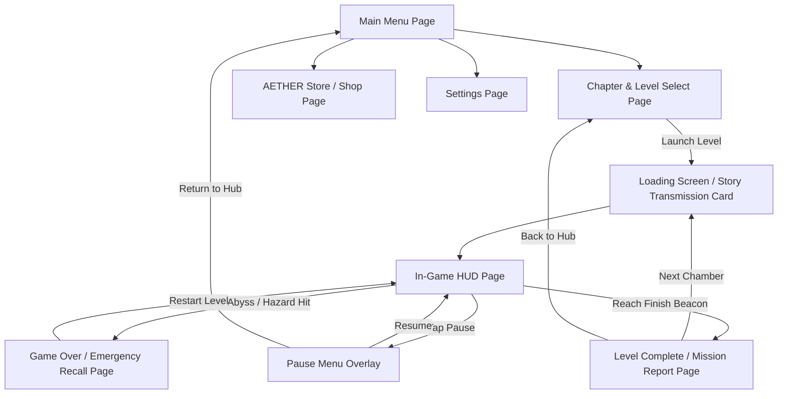

# Gravity Painter — Complete Game Architecture, Pages & Theme Overview

**Document Version:** 2.5 (Master Reference)  
**Project Name:** `GravityPainterPrototype`  
**Engine & Platform:** Unity 6.3 LTS (`6000.3.11f1`) — Android & PC (New Input System)  
**Core Concept:** *"You don't control the probe — you control the laws of physics."*

---

## 1. Executive Summary & Core Identity

**Gravity Painter** is a 3D Sci-Fi Physics Puzzle game designed for Android. Instead of directly joystick-steering the player ball, the player acts as a remote operator on Earth guiding an unmanned research probe (`GRP-7`) across floating alien puzzle chambers on the exoplanet **Velorath**.

The player navigates by **painting floor tiles with gravity vectors** through touch/click taps. Each tap cycles the tile's local gravitational force field:
- **⬜ Neutral (Grey / Null):** Zero artificial force (`Vector3.zero`). The ball rests or rolls on momentum alone.
- **🔴 Red (*Akara*):** Forward Acceleration (`transform.forward`). Pushes the probe along the tile's local forward orientation.
- **🔵 Blue (*Seval*):** Left Deflection (`-transform.right`). Pushes the probe to the tile's local left.
- **🟡 Yellow (*Thovar*):** Right Deflection (`transform.right`). Pushes the probe to the tile's local right.

---

## 2. Theme, Lore & Visual Aesthetics — *"Signal from Velorath"*

### 2.1 The Cosmic Lore
In the year **2187**, deep-space research organization **AETHER Labs** dispatched Gravitational Research Probe 7 (`GRP-7`) to investigate anomalous gravity fluctuations on **Velorath**. The planet is ringed by colossal, floating architectural platforms left behind by an ancient, extinct civilization known as the **Velori**.

Upon touching down on the outer ring platforms, `GRP-7`'s internal drive propulsion was disabled by the planet's erratic gravitational tides. However, its sensory array established a link with the **ancient Velori chromatic floor grid**. As the Earth-based Remote Operator, you reprogram the chromatic frequency of each floor tile in real-time to generate gravitational slipstreams, guiding `GRP-7` safely across chasms, past automated defense systems, and toward the signal transmitters (`Velara Beacons`).

### 2.2 Visual Theme & Design Language
The visual presentation combines **high-contrast Sci-Fi Cyberpunk neon** with **deep cosmic atmosphere**:
- **Environment Backdrop (`SkyCitySkybox` & `LevelEnvironment`):** A breathtaking 360° panoramic alien sky city with glowing orbital rings, distant platform decks, and deep cosmic horizons.
- **Probe Architecture (`Sci-Fi Ball 3D Model.glb`):** A detailed metallic sphere featuring an active red glowing sensory ring around its equatorial axis (`BallController.cs`, `BallPreviewRenderer.cs`).
- **Platform Tiles (`tiles.glb` & `TileGlbVisual.cs`):** Sleek, modular high-tech floor slabs (`Scale: 1, 0.1, 1`) with glowing edge channels that dynamically change Albedo and Emission colors when painted (`RedZone`, `BlueZone`, `YellowZone`, `DefaultZone`).
- **Audio & Haptic Feedback:** Immersive cosmic ambient hums, distinct chromatic paint chimes per color, metallic rolling loops, and tactile haptic pulses when changing gravity zones on mobile devices.

---

## 3. Comprehensive Inventory of All Game "Pages" (Scenes & UI Screens)

In Unity, our game's "pages" are divided into **Level/Menu Scenes** (`Assets/Scenes/`) and **UI Screens / Canvases / Modal Overlays** (`Assets/Scripts/UI/`). Below is the complete catalog of every page implemented in the project.

### 3.1 Scene Inventory (`Assets/Scenes/` & Project Root)

| Scene Name | File Path | Primary Purpose & Features |
| :--- | :--- | :--- |
| **Main Menu Scene** | `Assets/Scenes/Menus/MainMenu.unity` | The primary entry point and home screen. Hosts the central canvas hub (`MainMenu.cs`), video/3D skybox background (`MainMenuVideoBackground.cs`), store routing, and progression tracking. |
| **Game Scene** | `Assets/Scenes/GameScene.unity` | The core dynamic gameplay stage used for rendering individual puzzle chambers, managing physics loops, and hosting game overlays. |
| **Loading Scene** | `Assets/Scenes/LoadingScene.unity` | Dedicated asynchronous transition scene (`LoadingScreen.cs`) that displays loading progress bars, story transmission briefings, and tips when moving between major game modes. |
| **Procedural Test Arena** | `Assets/Procedural(test).unity` | The runtime procedural playtest stage where algorithmically generated levels (Steps 1 & 2 path generation, edge-aligned turns, corner pads, coins, and power-ups) are played. Also serves as the live target when selecting Level 3+ from the menu. |
| **Developer Level Select**| `Assets/Scenes/Menus/DeveloperProceduralLevelSelect.unity`| Internal developer/debug menu scene (`DeveloperProceduralLevelSelect.cs`) allowing direct testing of specific seed numbers (`e.g., 12345`), path generation algorithms, and difficulty scalers. |
| **Level 1 Scene** | `Assets/Scenes/Levels/Level 1.unity` | Campaign Chapter 1 Stage 1 (*First Contact*). Hand-crafted introductory tutorial chamber featuring master coin hierarchy (`Coin_Master_Tile(46)`), basic straight paths, and initial red zone painting. |
| **Level 2 Scene** | `Assets/Scenes/Levels/Level 2.unity` | Campaign Chapter 1 Stage 2 (*Three Frequencies*). Hand-crafted puzzle introducing 90° turns, blue/yellow side deflections, `LaserGate` obstacles, and the master GLB reference layout (`TileGlbReferenceLayout.asset`). |
| **Level 3 – 5 Scenes** | `Assets/Scenes/Levels/Level 3-5.unity` | Campaign chapter milestones leading up to more complex environmental hazards and linking the narrative directly into the procedural campaign structure. |

---

### 3.2 UI Screen, Menu & Canvas Inventory (`Assets/Scripts/UI/`)

Every interactive interface page is built using high-performance Unity Canvas systems and styled to match the AETHER Labs sci-fi terminal interface.



#### 1. Main Menu Page (`MainMenu.cs`)
* **Visual Presentation:** Clean sci-fi dashboard featuring a live 3D probe preview or video loop background (`MainMenuVideoBackground.cs`), stylized futuristic typography, and glowing interactive buttons (`MainMenuButtonLayout.cs`).
* **Operator Rank Header:** Displays the player's current Earth Operator title (e.g., *Cadet Operator*, *Field Operator*, *Gravity Engineer*) based on total stars collected across Velorath.
* **Navigation Links:** Quick-action buttons to **Start / Continue Mission**, **Level Select**, **AETHER Store**, **Settings**, and **Developer Debug Menu**.

#### 2. Chapter & Level Selection Page (`LevelMenu.cs`)
* **Structure:** Organized into **5 Distinct Chapters** representing different planetary sectors of Velorath:
  1. *Chapter 1: The Awakening* (Outer Platform Ring — Clean alien skies)
  2. *Chapter 2: The Fractured Bridge* (Crumbling mid-platform — Stormy atmosphere)
  3. *Chapter 3: The Guardian's Path* (Inner Sanctum — Automated defense systems active)
  4. *Chapter 4: The Deep Current* (Underground Sector — Gravity wind streams & teleporters)
  5. *Chapter 5: The Core Signal* (Central Velori Machine — All mechanics & final boss stage)
* **Level Cards:** 12 primary level slots displaying individual completion checks (✅), Star Ratings (⭐ to ⭐⭐⭐), and locked status badges (🔒). Selecting Level 3 and above dynamically initializes the procedural generation engine (`ProceduralLevelBuilder.cs`).

#### 3. In-Game HUD & Gameplay Page (`GameHUD.cs` & `CoinDisplayUI.cs`)
* **Minimalist Top Bar:** Designed for maximum visibility of the 3D puzzle floor. Displays current Level Title / Chapter Designation and active **AETHER Credit (AC)** coin balance (`CoinWallet` / `CoinManager.cs`).
* **Paint Charge Counter (`PaintCounter`):** On advanced chapters, displays the remaining gravity paint charges available for the stage, challenging players to optimize their vector paths.
* **Active Power-Up Indicators:** Shows countdown meters when `GRP-7` absorbs Velori artifacts like the **Speed Core** (⚡ +50% momentum) or **Phase Shell** (🛡️ one-hit hazard immunity).
* **Control Buttons:** Quick-tap **Pause** button and optional **Camera Reset/View Angle** toggles.

#### 4. Story Transmission Briefing Card (`TransmissionCard`)
* **Pre-Level Overlay:** Before a chamber begins, an AETHER Labs transmission log slides into view:
  > **CHAPTER 1 — LEVEL 1: FIRST CONTACT**  
  > *"GRP-7 has touched down on Platform Outer-7. Gravity here is calm. Our scientists have identified three Velori tile types: red acceleration fields, blue deflectors, and yellow deflectors. Reprogram them to guide the probe to the beacon. Good luck, operator."*
* **Action:** Contains a prominent **[Begin Mission]** button to initiate probe release.

#### 5. Pause Menu Overlay Page (`PauseUI.cs`)
* **Modal Popup:** Blurs the underlying gameplay stage (`Time.timeScale = 0f`).
* **Actions:** **[Resume Mission]**, **[Restart Level]**, **[Audio / Haptic Settings]**, and **[Abort to Main Menu]**.

#### 6. Level Complete / Mission Report Page (`LevelCompleteUI.cs` & `LevelCompleteCanvasFactory.cs`)
* **Victory Screen:** Displayed when `GRP-7` enters the `Velara Beacon` trigger gate (`FinishLine.cs`), causing a satisfying physical rebound and completing the stage.
* **Performance Evaluation:**
  - **Star Rating Earned:** ⭐ (Clear), ⭐⭐ (Under Time Limit), ⭐⭐⭐ (Under Time + Paint Count Budget).
  - **Rewards Display:** Shows earned AETHER Credits (+10 AC base clear, +15 AC perfection bonus, plus collected in-level session coins).
* **Navigation:** **[Watch Replay]** (`ReplayRecorder`), **[Next Level]**, **[Replay Stage]**, and **[Return to Chapter Hub]**.

#### 7. Game Over / Emergency Recall Page (`GameOverUI.cs`)
* **Trigger Conditions:** Activated when `GRP-7` falls off the platform edge into `The Abyss` or collides with lethal hazards like a `Korrath Zone` (corrupted death tile), `HammerHazard` (swinging defense arm), or `LaserGate` (energy fence).
* **Lore Integration:** Instead of a generic "You Died" message, the screen shows an **"AETHER Emergency Recall Activated"** alert with a 5-second signal countdown representing the travel time for Earth's recall tractor beam.
* **Actions:** **[Instant Recall & Restart]** or **[Return to Hub]**.

#### 8. AETHER Store / Probe Customization Page (`StoreUI.cs`, `TestStoreUI.cs`, `TestStoreWiring.cs`)
* **Economy System:** Players spend collected **AETHER Credits (AC)** on new research probe models (`BallSkinData.cs`) and consumable Velori relics.
* **Interactive 3D Preview (`BallPreviewRenderer.cs`):** Rotates the selected probe model in a dedicated preview viewport.
* **Available Probe Skins:**
  - *GRP-7 Standard:* Base white/metallic research probe (Free).
  - *Chrome Sentinel (GRP-1):* Decommissioned shiny mirror-finish probe (500 AC).
  - *Neon Pathfinder (GRP-3):* High-visibility neon glowing trim for dark platforms (800 AC).
  - *Plasma Core (GRP-9):* Experimental probe with pulsing internal energy (1200 AC).
  - *Hologram Shell (GRP-X):* Translucent energy field phantom probe (2000 AC).
  - *Velori Relic:* Mysterious ancient sphere unlocked by completing all 12 campaign levels.

#### 9. Settings Configuration Page (`SettingsUI.cs`)
* **Audio Controls:** Master Volume, Music/Ambience Volume, and Sound Effects (SFX) Volume sliders.
* **Control Preferences:** Touch sensitivity, camera follow damping (`CameraFollow.cs`), and haptic vibration feedback toggles.
* **Graphics & Performance:** Quality toggles (Post-processing glow / Bloom, Target Framerate 60 FPS / 120 FPS).

#### 10. Loading Screens & Overlays (`LoadingScreen.cs` & `LoadingOverlay.cs`)
* **Asynchronous Transition:** Keeps the user engaged with high-resolution Velorath conceptual artwork, real-time loading progress bars, and lore tips (`e.g., "Tip: Rotate your perspective! Red tiles push along the tile's local forward axis, not world forward."`).

---

## 4. Complete Gameplay & Mechanics Reference

### 4.1 Zone Mechanics & Physics Engine (`TileZone.cs` & `BallController.cs`)
All forces are calculated relative to the **tile's local transform** and applied inside Unity's `FixedUpdate()` for framerate-independent physics:
```csharp
// TileZone.cs - Calculates force vector based on tile's rotation
public Vector3 GetForceDirection()
{
    switch (zoneType)
    {
        case ZoneType.Red:    return transform.forward;   // Local Forward
        case ZoneType.Blue:   return -transform.right;    // Local Left
        case ZoneType.Yellow: return transform.right;     // Local Right
        default:              return Vector3.zero;        // Neutral / Null
    }
}

// BallController.cs - Applies continuous force inside trigger zone
void FixedUpdate()
{
    if (currentZone != null)
    {
        rb.AddForce(currentZone.GetForceDirection() * forceStrength, ForceMode.Force);
    }
}
```

### 4.2 Power-Ups & Velori Artifacts (`PowerUpManager.cs`)
Collected mid-platform as glowing energy crystals:
- ⚡ **Speed Core (*Akara Shard*):** Temporarily increases probe speed and force strength by 50% (`forceStrength = 15f`).
- 🧲 **Gravity Anchor (*Anchor Stone*):** Pulls `GRP-7` slightly toward the center line of painted tiles to prevent edge slipping on turns.
- 🛡️ **Phase Shell (*Resonance Barrier*):** Generates an energy shield around the probe that absorbs one collision with a `HammerHazard` or `LaserGate`.

### 4.3 Obstacles & Hazards across Chapters
- **Corrupted Death Tiles (*Korrath Zone*):** Black-red flashing tiles that trigger instant emergency recall upon contact.
- **Swinging Hammers (*Guardian Arm*):** Automated Velori pendulums that sweep across the path (`HammerHazard.cs`).
- **Laser Gates (*Korrath Beam*):** Timed energy barriers that pulse on and off (`LaserGate.cs`).
- **Checkpoints (`Checkpoint.cs`):** Mid-level Velori anchor pads that save probe progress during long procedural stages so players do not restart from the very beginning.

---

## 5. Procedural Level Generation Architecture (`Assets/Scripts/Procedural/`)

To provide infinite replayability beyond the 12-level campaign, `Gravity Painter` includes a full runtime procedural level generator operable in `Procedural(test).unity` and routed via Chapter Level Select:

| Script / Asset | Technical Function |
| :--- | :--- |
| `ProceduralPathGenerator.cs` | Pure C# algorithm executing seeded, biased backtracking random walks on a grid (`LevelCell.cs`) with snake-path fallback to ensure 100% solvable paths. |
| `ProceduralLevelBuilder.cs` | Spawns Level 2 GLB tile prefabs (`tiles.glb`), positions `GRP-7` at the start, places the `Velara Beacon` at the end, and injects coins, power-ups, and checkpoints along the path. |
| `ProceduralTilePlacement.cs` | Calculates precise **edge-aligned tile coordinates** and automatically inserts **2 forward-aligned corner pad tiles (`cornerPadTileCount = 2`)** at every 90° turn to prevent the ball from falling into gaps during cornering. |
| `ProceduralPathVisualizer.cs` | Editor-mode gizmo and inspector utility for previewing generated paths before entering Play Mode. |
| `LevelGenConfig.cs` (`LevelGenConfig_Default.asset`) | ScriptableObject storing grid dimensions (`width=5, length=15`), spacing (`tileSpacing=1.2f`), obstacle densities, and coin/power-up spawn rates (`CampaignCoinPlacement.cs`). |
| `DifficultyManager.cs` / `DifficultyScaler.cs` | Automatically scales procedural path length, turn frequency, and hazard density based on the player's current progression and selected difficulty tier. |

---

## 6. Project Directory & File Map

```
Assets/
├── Art/
│   ├── Icons/              App marketing icons & UI badges
│   ├── Materials/
│   │   ├── Tiles/          RedZone, BlueZone, YellowZone, DefaultZone, CoinMaterial
│   │   └── Environment/    PlanetLand, PlatformDeck, BoardColor, SkyCitySkybox
│   ├── Models/
│   │   └── GLB/            Sci-Fi Ball 3D Model.glb, tiles.glb, coins.glb, RedLaserBeam.glb
│   ├── Physics/            GroundPhysics.physicMaterial (Friction 0.4, Bounciness 0)
│   └── Sprites/UI/         AETHER Labs HUD textures, button panels & icons
├── Editor/                 Unity Menu Tools (Gravity Painter → Test Path / Apply Ball Model)
├── Prefabs/
│   ├── Gameplay/           Tile.prefab, Coin.prefab, Checkpoint.prefab
│   ├── Obstacles/          Hammer.prefab, KorrathBeam.prefab, LaserGate.prefab
│   └── PowerUps/           SpeedCore.prefab, Magnet.prefab, Shield.prefab
├── Resources/
│   ├── Prefabs/            CoinVisual, SciFiBallVisual, TilesGlbMesh
│   └── Settings/           CoinAppearanceProfile.asset
├── Scenes/
│   ├── Menus/              MainMenu.unity, DeveloperProceduralLevelSelect.unity
│   ├── Levels/             Level 1.unity, Level 2.unity, Level 3-5.unity
│   ├── GameScene.unity     Core dynamic gameplay container
│   └── LoadingScene.unity  Asynchronous loading transition screen
├── Procedural(test).unity  Runtime procedural test arena
├── Scripts/
│   ├── Core/               TileZone.cs, BallController.cs, InputManager.cs, TileGlbVisual.cs
│   ├── Gameplay/           GameManager.cs, FinishLine.cs, LaserGate.cs, HammerHazard.cs, Coin.cs
│   ├── Procedural/         ProceduralPathGenerator.cs, ProceduralLevelBuilder.cs, ProceduralTilePlacement.cs
│   ├── Systems/            CameraFollow.cs, LevelEnvironment.cs, LevelProgress.cs, Checkpoint.cs
│   └── UI/                 MainMenu.cs, LevelMenu.cs, GameHUD.cs, PauseUI.cs, LevelCompleteUI.cs, StoreUI.cs, SettingsUI.cs, LoadingScreen.cs
└── Settings/
    ├── LevelGenConfig_Default.asset
    ├── TileGlbReferenceLayout.asset
    └── URP Assets & New Input System Actions
```

---

## 7. Summary & Next Development Steps

This document (`GAME_PAGES_AND_THEME_OVERVIEW.md`) serves as the single source of truth explaining **all scenes, UI pages, themes, lore, and gameplay mechanics** implemented in `Gravity Painter`.

### Recommended Next Implementation Actions:
1. **Visual Polish on UI Screens:** Verify that all pages (`MainMenu.cs`, `LevelMenu.cs`, `StoreUI.cs`, `GameHUD.cs`) transition smoothly with crisp sound effects (`AudioManager`) and clear typography.
2. **Transmission Cards UI:** Wire up the slide-in `TransmissionCard` pre-level overlay for Level 1 and Level 2 to present the AETHER Labs story card before the puzzle starts.
3. **Procedural Campaign Integration:** Finalize the transition so completing Level 5 in `LevelMenu.cs` seamlessly opens procedural daily/infinite challenges with full star tracking.
